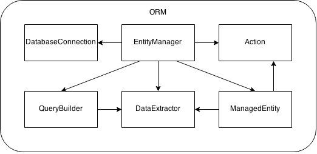

3APL - ORM
===

SUPINFO B.Sc. – ORM

Each arrow means "use". For instance, the "EntityManager" uses the "QueryBuilder".

### Group members

* Nicolas MICHAUD (143125)
* Wassim DHIF (159979)
* Nicolas ROUVIERE (158390)
* Samy LAUMONIER (159024)
